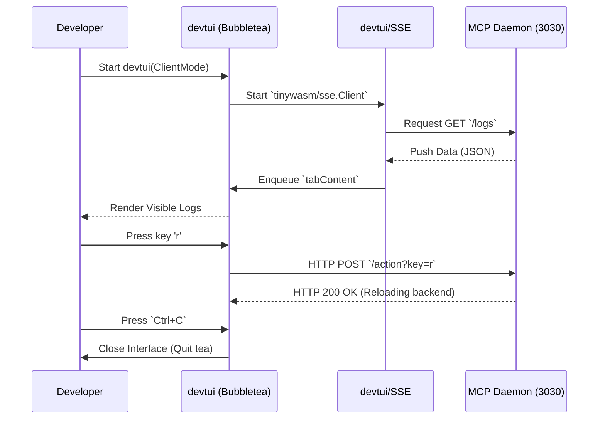

```mermaid
sequenceDiagram
    participant Dev as Developer
    participant Bubble as devtui (Bubbletea)
    participant SSEClient as devtui/SSE
    participant MCPServer as MCP Daemon (3030)

    %% Streaming Start %%
    Dev->>Bubble: Start devtui(ClientMode)
    Bubble->>SSEClient: Start `tinywasm/sse.Client`
    SSEClient->>MCPServer: Request GET `/logs`
    MCPServer-->>SSEClient: Push Data (JSON)
    SSEClient->>Bubble: Enqueue `tabContent`
    Bubble-->>Dev: Render Visible Logs

    %% Keyboard Interaction %%
    Dev->>Bubble: Press key 'r'
    Bubble->>MCPServer: HTTP POST `/action?key=r`
    MCPServer-->>Bubble: HTTP 200 OK (Reloading backend)
    
    %% Local Exit %%
    Dev->>Bubble: Press `Ctrl+C`
    Bubble->>Dev: Close Interface (Quit tea)
```
