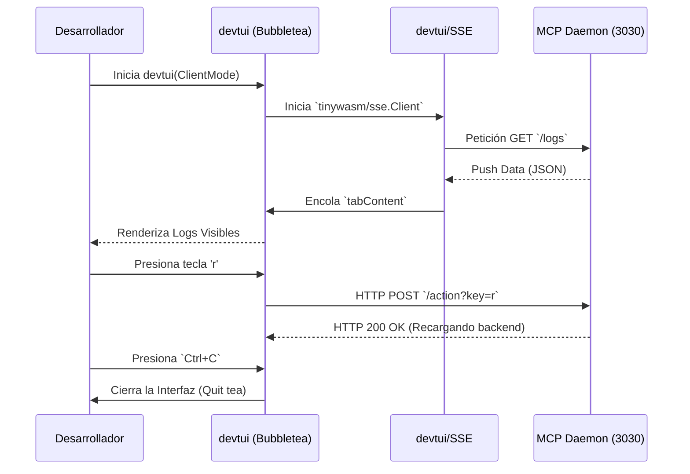

```mermaid
sequenceDiagram
    participant Dev as Desarrollador
    participant Bubble as devtui (Bubbletea)
    participant SSEClient as devtui/SSE
    participant MCPServer as MCP Daemon (3030)

    %% Inicio del Streaming %%
    Dev->>Bubble: Inicia devtui(ClientMode)
    Bubble->>SSEClient: Inicia `tinywasm/sse.Client`
    SSEClient->>MCPServer: Petición GET `/logs`
    MCPServer-->>SSEClient: Push Data (JSON)
    SSEClient->>Bubble: Encola `tabContent`
    Bubble-->>Dev: Renderiza Logs Visibles

    %% Interacción del teclado %%
    Dev->>Bubble: Presiona tecla 'r'
    Bubble->>MCPServer: HTTP POST `/action?key=r`
    MCPServer-->>Bubble: HTTP 200 OK (Recargando backend)
    
    %% Salida Local %%
    Dev->>Bubble: Presiona `Ctrl+C`
    Bubble->>Dev: Cierra la Interfaz (Quit tea)
```
